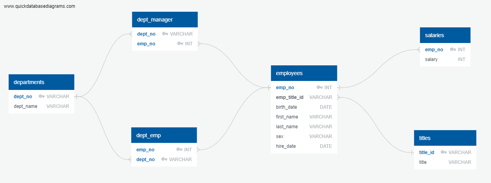
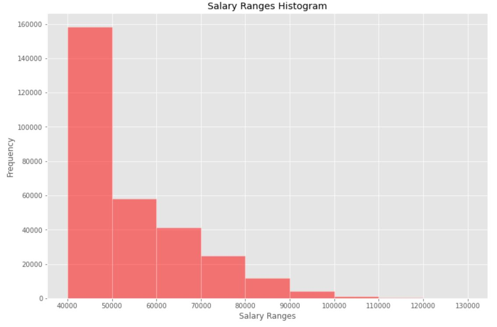
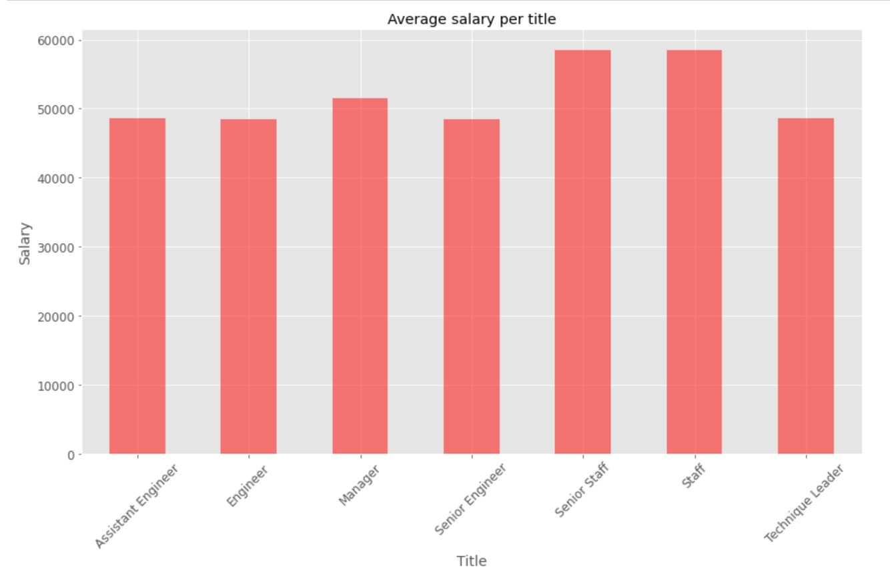

# Employees records analysis with SQL
SQL project for Monash Data Analytics Boot Camp

The purpose of this project was to analyse the database of six CSV files cotaining fictitious data about employees from period the 1980s and 1990s.

# Data

There are six key sources of data used:

* [departments.csv](EmployeeSQL/departments.csv) - .csv departments dataset composed of two columns: `dept_no` and `dept_name`

* [dept_emp.csv](EmployeeSQL/dept_emp.csv) - .csv departments employees dataset composed of two columns: `emp_no` and `dept_no`

* [dept_manager.csv](EmployeeSQL/dept_manager.csv) - .csv departments manager dataset composed of two columns: `dept_no` and `emp_no`

* [employees.csv](EmployeeSQL/employees.csv) - .csv employees dataset composed of seven columns: `emp_no`, `emp_title_id`, `birth_date`, `first_name`, `last_name`, `last_name` and `hire_date`

* [salaries.csv](EmployeeSQL/salaries.csv) - .csv salaries dataset composed of two columns: `emp_no` and `salary`

* [titles.csv](EmployeeSQL/departments.csv) - .csv titles dataset composed of two columns: `title_id` and `title`

# Analysis

* Sketch out an Entity Relationship Diagram (ERD) of the tables:

* Create a table schema for each of the six CSV files in PostgreSQL

* Import each CSV file into the corresponding SQL table

* Retrive the following data from the database:
    * List the following details of each employee: employee number, last name, first name, sex, and salary
    * List first name, last name, and hire date for employees who were hired in 1986.

    * List the manager of each department with the following information: department number, department name, the manager's employee number, last name, first name.

    * List the department of each employee with the following information: employee number, last name, first name, and department name.

    * List first name, last name, and sex for employees whose first name is "Hercules" and last names begin with "B."

    * List all employees in the Sales department, including their employee number, last name, first name, and department name.

    * List all employees in the Sales and Development departments, including their employee number, last name, first name, and department name.

    * In descending order, list the frequency count of employee last names, i.e., how many employees share each last name.

* Import the SQL database into Jupyter Notebook 

* Create a histogram to visualize the most common salary ranges for employees

* Create a bar chart of average salary by title

# Demo

To run the example locally create table schema for each of the six CSV files in PostgreSQL using the `schema.sql` file. Import each CSV file into the corresponding SQL table. Perform the sql query using the `query.sql` file. Run the `sql-challenge.ipynb` file in Jupyter Notebook .

# Used Tools
 * Jupyter Notebook 
 * Pandas
 * Matplotlib
 * sqlalchemy  
 * PostgreSQL
